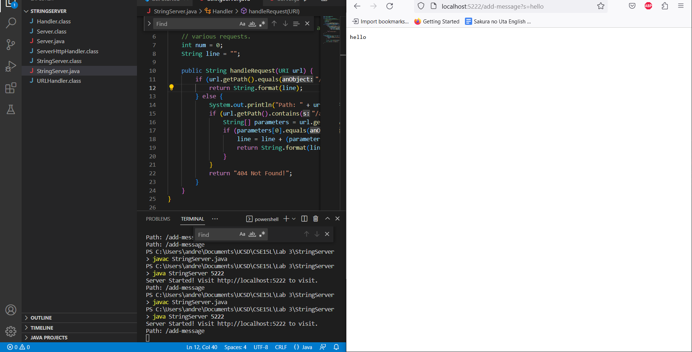
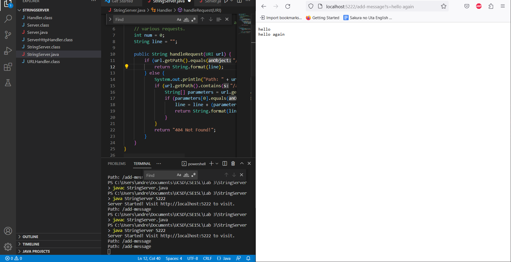
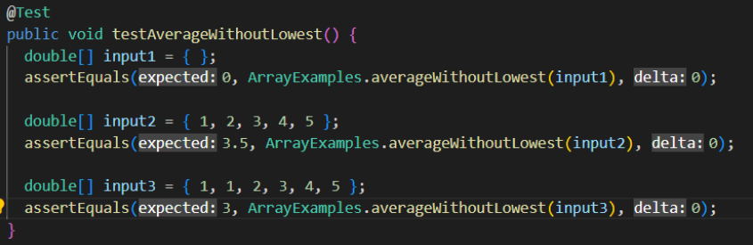
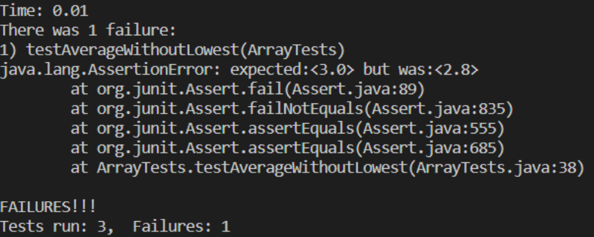

# Lab Report 2
Welcome to CSE 15L Lab Report 2. This week we're dealing with servers. Yeah, real hackerman stuff. 

## Part 1
I set up the StringServer.java file to run on my computer at `localhost:5222`. I input the link 'http://localhost:5222/add-message?s=hello', as seen at the top.



I did it again, but this time with the input link 'http://localhost:5222/add-message?s=hello%20again'



**Which methods in your code are called?**
There are the `handleRequest`, `getPath`, `equals`, `format`, `contains`, and the `main` method. 

**What are the relevant arguments to those methods, and the values of any relevant fields of the class?**
* `handleRequest`: Takes the `(URI url)` argument, which takes entire URL as an input. There is a string nammed `line` which initializes as an empty string but will later be modified to be the input to the `format` method. 
* `equals`: Takes in a string as an argument and compares it to the current string.
* `format`: Formats a string with formatting methods and is returned to the server.
* `contains`: Checks if a string contains a certain substring (the argument).

**How do the values of any relevant fields of the class change from this specific request? If no values got changed, explain why.**
The value of `url` doesn't change, it represents the input from the user, and is then picked apart.
The `line` value changes based on the input if the correct path and query is provided. It updates based on the query and adds a line break to the end. 

## Part 2
I chose to look at the `averageWithoutLowest` function. 
Input 1 and 2 are working inputs, but input 3 is a failure-incuding input.




The method as it is written records the value of the lowest number, but not the index, meaning that if there are multiple values of the lowest number, they will all not be included in the sum that calculates the average, leading to a lower average than expected. (It should only remove 1 number.)

The method before is as follows: 
 ```
 static double averageWithoutLowest(double[] arr) {
    if(arr.length < 2) { return 0.0; }
    double lowest = arr[0];
    for(double num: arr) {
      if(num < lowest) { lowest = num; }
    }
    double sum = 0;
    for(double num: arr) {
      if(num != lowest) { sum += num; }
    }
    return sum / (arr.length - 1);
  }
 ```
